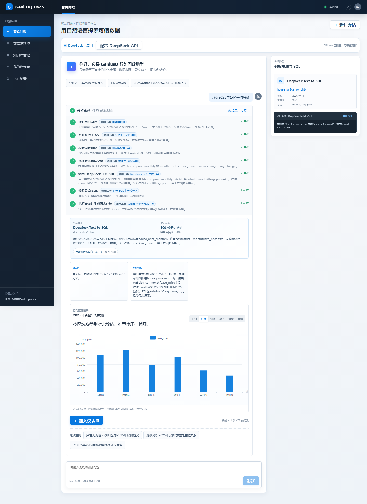
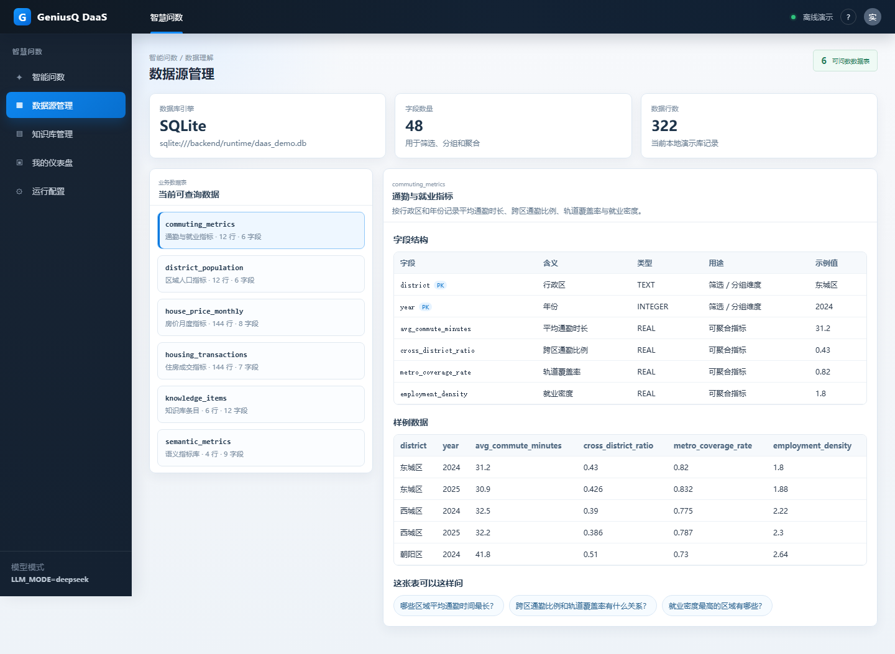
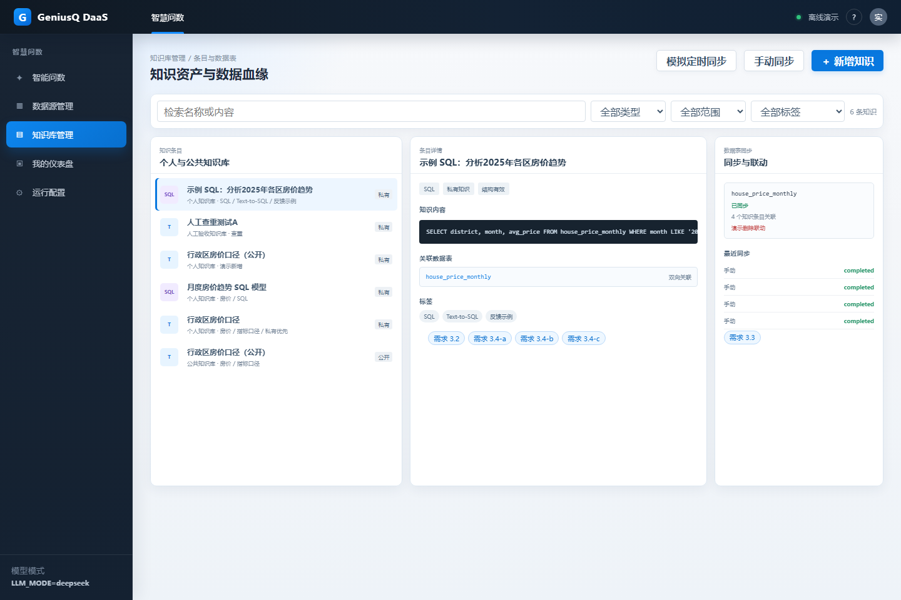
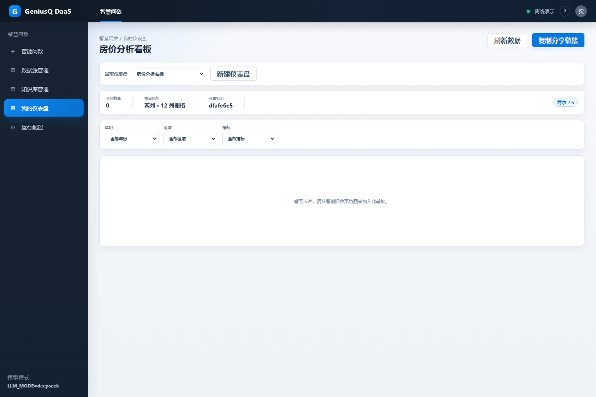
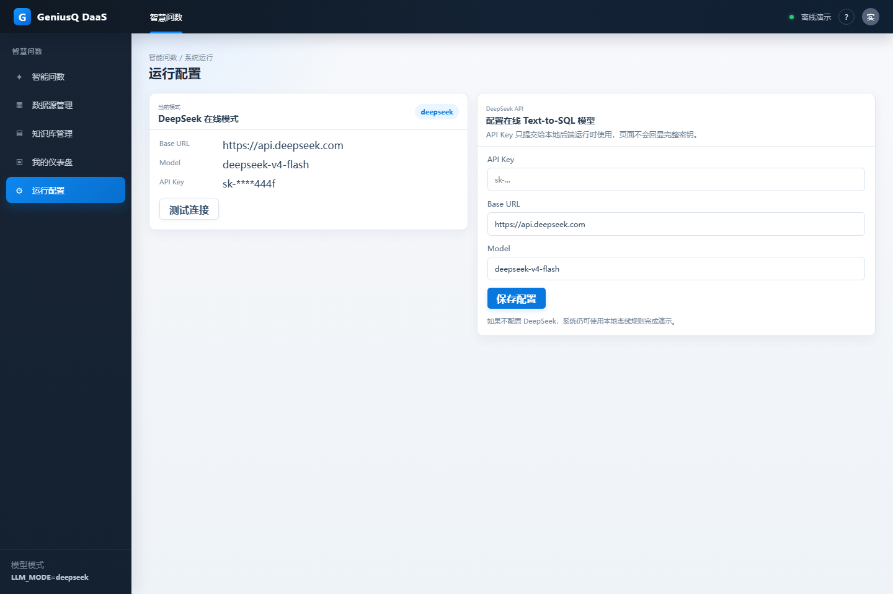

# GeniusQ DaaS Intelligent Query Demo

[中文](#中文说明) | [English](#english)

## 中文说明

GeniusQ DaaS Intelligent Query Demo 是一个可在本地运行的小型全栈演示项目，用来展示企业数据平台中的“智能问数”体验。用户可以用自然语言提问，系统会结合知识库、数据表结构和 DeepSeek Text-to-SQL 生成只读 SQL，再查询本地 SQLite 演示库，自动生成图表、结论、追问建议和仪表盘。

本项目不连接生产数据，所有演示数据均由本地 SQLite 自动生成，适合用于产品方案展示、技术可行性说明和后续平台集成前的原型验证。

### 功能模块

#### 1. 智能问数工作台

用户输入自然语言问题后，系统会展示类似 Agent 的逐步执行过程，包括理解问题、合并上下文、检索知识、选择表字段、调用 DeepSeek、校验 SQL、执行查询和生成图表。结果区会展示 SQL、数据来源、图表、洞察结论和后续可追问问题。



核心能力：

- DeepSeek Text-to-SQL，支持本地离线规则兜底。
- 多轮上下文理解，例如“那上一年呢”“只看海淀区”。
- SQL 只读安全校验，仅允许单条 `SELECT` / `WITH` 查询。
- 自动图表推荐与字段修复，避免模型生成的图表字段和 SQL 结果不一致。
- 结果后推荐 3 个不重复的后续问题。

#### 2. 数据源管理

数据源页面直接读取当前 SQLite 数据库结构，展示可问数的数据表、字段、字段含义、字段类型、用途、样例值和样例数据。每张表还会提供“这张表可以这样问”的推荐问题，点击后会跳转到智能问数页面并自动填入问题。



核心能力：

- 自动读取当前数据库表结构。
- 隐藏内部运行表，只展示适合用户理解的数据源。
- 标注字段角色：筛选 / 分组维度、可聚合指标、文本说明。
- 根据表结构生成可问问题。

#### 3. 知识库管理

知识库页面用于管理 Text-to-SQL 前的检索增强内容，包括业务口径、SQL 示例、规则说明和表关联信息。系统会在生成 SQL 前检索相关知识，让模型更容易理解字段含义和业务约束。



核心能力：

- 私有 / 公共知识条目管理。
- 通过标签、类型、范围筛选知识。
- 知识与数据表建立关联。
- 支持模拟同步、手动同步和冲突提示。

#### 4. 仪表盘

问数结果可以保存到仪表盘。仪表盘支持两列布局、卡片拖动排序、图表类型切换、筛选器、刷新、移除和本地只读分享。



核心能力：

- 保存问数结果为分析卡片。
- 支持折线图、柱状图、饼图、散点图、堆叠柱状图和表格。
- 年份、区域、指标筛选。
- 本地分享链接与只读查看页。

#### 5. 运行配置

运行配置页面用于查看当前模型模式，并配置 / 测试 DeepSeek API。API Key 只提交给本地后端运行时使用，页面不会回显完整密钥，也不会提交到 Git 仓库。



核心能力：

- 显示当前模式：离线模式或 DeepSeek 在线模式。
- 显示脱敏 API Key。
- 配置 Base URL、Model 和 API Key。
- 测试 DeepSeek 连接；失败时显示明确错误提示。

### 项目架构

```text
┌──────────────────────────────────────────────────────────────┐
│ Frontend: React + Vite + TypeScript                          │
│                                                              │
│  Query Workspace      自然语言问数、Agent 步骤、图表结果       │
│  DataSource Workspace 数据库结构、字段含义、样例数据           │
│  Knowledge Workspace  知识条目、标签筛选、表关联               │
│  Dashboard Workspace  卡片布局、图表切换、分享查看             │
│  Settings Workspace   DeepSeek API 配置与连接测试             │
└───────────────────────────────┬──────────────────────────────┘
                                │ REST API
┌───────────────────────────────▼──────────────────────────────┐
│ Backend: FastAPI                                              │
│                                                              │
│  api/                  HTTP 路由层                            │
│  services/conversation  会话上下文、Agent 轨迹、查询编排       │
│  services/text_to_sql   DeepSeek Text-to-SQL 调用              │
│  services/sql_guard     只读 SQL 校验与表权限检查              │
│  services/datasource    SQLite 表结构 introspection            │
│  services/knowledge     知识检索、去重、同步                   │
│  services/dashboard     仪表盘、卡片、分享链接                 │
│  seed.py                演示数据库 schema 和种子数据           │
└───────────────────────────────┬──────────────────────────────┘
                                │ SQLAlchemy
┌───────────────────────────────▼──────────────────────────────┐
│ SQLite demo database                                           │
│ backend/runtime/daas_demo.db                                   │
│                                                              │
│ house_price_monthly / housing_transactions                    │
│ district_population / commuting_metrics                       │
│ knowledge_items / semantic_metrics / dashboards               │
└──────────────────────────────────────────────────────────────┘
```

### 目录结构

```text
backend/
  app/
    api/          FastAPI 路由
    services/     问数、知识库、SQL、安全校验、仪表盘和数据源服务
    config.py     环境变量与运行配置
    db.py         SQLAlchemy engine/session
    seed.py       SQLite schema 与演示数据
  tests/          后端测试

frontend/
  src/
    pages/        智能问数、数据源、知识库、仪表盘、运行配置页面
    components/   图表、时间线、徽章、数据来源卡片等组件
    utils/        仪表盘筛选等工具函数
    test/         前端单元测试

docs/
  assets/readme/  README 截图
  superpowers/    设计文档与实施计划

start-demo.ps1    Windows 一键启动脚本
```

### 运行环境

- Windows 10/11
- PowerShell 5.1+
- Python 3.9+
- Node.js 18+

### 一键启动

在项目根目录执行：

```powershell
powershell -ExecutionPolicy Bypass -File .\start-demo.ps1
```

只启动服务、不自动打开浏览器：

```powershell
powershell -ExecutionPolicy Bypass -File .\start-demo.ps1 -NoBrowser
```

依赖已经安装时可跳过依赖检查：

```powershell
powershell -ExecutionPolicy Bypass -File .\start-demo.ps1 -NoBrowser -SkipInstall
```

默认访问地址：

- 前端：[http://127.0.0.1:5173](http://127.0.0.1:5173)
- 后端健康检查：[http://127.0.0.1:8000/api/health](http://127.0.0.1:8000/api/health)
- OpenAPI 文档：[http://127.0.0.1:8000/docs](http://127.0.0.1:8000/docs)

### 手动启动

终端一：

```powershell
python -m pip install -e "backend[test]"
python -m uvicorn app.main:app --app-dir .\backend --host 127.0.0.1 --port 8000
```

终端二：

```powershell
cd frontend
npm.cmd ci
npm.cmd run dev -- --port 5173
```

### DeepSeek 配置

项目默认可以使用离线演示模式：

```dotenv
LLM_MODE=offline
```

如需启用真实 DeepSeek Text-to-SQL，有两种方式：

1. 在页面中打开「运行配置」或「配置 DeepSeek API」，填写 API Key、Base URL 和模型名。
2. 在本地创建 `.env` 文件：

```dotenv
LLM_MODE=deepseek
DEEPSEEK_API_KEY=your-deepseek-api-key
DEEPSEEK_BASE_URL=https://api.deepseek.com
DEEPSEEK_MODEL=deepseek-v4-flash
```

真实 Key 只应保存在本地，不要提交到 GitHub。无论模型如何生成 SQL，后端都会先执行结构化解析、只读 SQL 校验和授权表检查，通过后才会查询本地 SQLite。

项目也保留了 OpenAI-compatible 模型网关的配置边界，方便后续替换或扩展其他大模型服务：

```dotenv
LLM_MODE=openai-compatible
LLM_BASE_URL=https://example.com/v1
LLM_API_KEY=your-key
LLM_MODEL=your-model
```

### 可测试问题示例

```text
分析2025年各区平均房价
分析2025年海淀区和朝阳区租金趋势
哪个区挂牌量最高，空置率如何？
房价是否和地铁覆盖率、就业密度相关？
对比2024年和2025年各区房价变化
```

### 验证命令

```powershell
python -m pytest backend/tests -q
cd frontend
npm.cmd run test:run
npm.cmd run build
```

当前验证结果：

- 后端测试：66 passed
- 前端测试：32 passed
- 前端生产构建：passed

### 常见问题

- 页面提示后端不可用：先访问 `/api/health`，确认后端是否启动。
- DeepSeek 连接失败：检查 `.env` 或运行配置页中的 `LLM_MODE`、`DEEPSEEK_API_KEY`、`DEEPSEEK_BASE_URL` 和 `DEEPSEEK_MODEL`。
- 图表为空或字段不匹配：后端会自动校验并修复图表字段；如仍出现问题，可刷新页面或重新提问。
- 想重置演示数据：停止服务后删除 `backend/runtime/daas_demo.db`，再次启动会自动重建。

## English

GeniusQ DaaS Intelligent Query Demo is a local full-stack demo for intelligent data querying in an enterprise data-platform scenario. Users ask questions in natural language; the system combines knowledge retrieval, table schemas, and DeepSeek Text-to-SQL to generate read-only SQL, query a local SQLite demo database, and return charts, insights, follow-up questions, and dashboard cards.

The project does not connect to production data. All demo data is generated locally in SQLite, making it suitable for product walkthroughs, technical feasibility validation, and pre-integration prototyping.

### Feature Modules

#### 1. Intelligent Query Workspace

After a user asks a natural-language question, the system shows an Agent-like execution trace: understanding the question, merging conversation context, retrieving knowledge, selecting tables and fields, calling DeepSeek, validating SQL, executing the query, and generating charts. The result area includes SQL, data sources, charts, insights, and follow-up questions.


Key capabilities:

- DeepSeek Text-to-SQL with an offline rule-based fallback.
- Multi-turn context handling, such as “what about last year?” or “only Haidian”.
- Read-only SQL validation; only single-statement `SELECT` / `WITH` queries are allowed.
- Automatic chart recommendation and field repair when model chart fields do not match SQL result columns.
- Three non-repeated follow-up questions after each completed analysis.

#### 2. Data Source Management

The datasource page reads the active SQLite database structure and displays queryable tables, fields, field meanings, types, roles, sample values, and sample rows. Each table also provides suggested questions; clicking one opens the query workspace and fills the question automatically.


Key capabilities:

- Reads the current database schema dynamically.
- Hides internal runtime tables and shows user-facing data sources only.
- Labels field roles: filter/group dimension, aggregatable metric, or text description.
- Generates suggested questions from table structure.

#### 3. Knowledge Management

The knowledge page manages retrieval-augmented context for Text-to-SQL, including business definitions, SQL examples, rule descriptions, and table links. Before generating SQL, the backend retrieves relevant knowledge to help the model understand fields and business constraints.


Key capabilities:

- Private and public knowledge entries.
- Filtering by tag, type, and scope.
- Links between knowledge entries and data tables.
- Simulated sync, manual sync, and conflict hints.

#### 4. Dashboard

Analysis results can be saved as dashboard cards. Dashboards support two-column layout, drag-and-drop ordering, chart type switching, filters, refresh, removal, and local read-only sharing.


Key capabilities:

- Save query results as analysis cards.
- Supports line, bar, pie, scatter, stacked bar, and table views.
- Filter by year, district, and metric.
- Local share links and read-only shared pages.

#### 5. Runtime Settings

The runtime settings page shows the current model mode and lets users configure or test DeepSeek API access. The API key is submitted only to the local backend runtime, is never fully echoed to the browser, and is not committed to the repository.


Key capabilities:

- Shows the active mode: offline or DeepSeek online.
- Displays a masked API key.
- Configures Base URL, model, and API key.
- Tests DeepSeek connectivity and shows clear errors when the test fails.

### Architecture

```text
┌──────────────────────────────────────────────────────────────┐
│ Frontend: React + Vite + TypeScript                          │
│                                                              │
│  Query Workspace      Natural-language query, Agent trace     │
│  DataSource Workspace Database schema, fields, sample rows     │
│  Knowledge Workspace  Knowledge entries, tags, table links     │
│  Dashboard Workspace  Card layout, chart switching, sharing    │
│  Settings Workspace   DeepSeek API setup and connection test   │
└───────────────────────────────┬──────────────────────────────┘
                                │ REST API
┌───────────────────────────────▼──────────────────────────────┐
│ Backend: FastAPI                                              │
│                                                              │
│  api/                  HTTP routers                           │
│  services/conversation  Context, Agent trace, query orchestration│
│  services/text_to_sql   DeepSeek Text-to-SQL integration       │
│  services/sql_guard     Read-only SQL validation               │
│  services/datasource    SQLite schema introspection            │
│  services/knowledge     Knowledge retrieval and sync           │
│  services/dashboard     Dashboards, cards, share links         │
│  seed.py                Demo database schema and seed data      │
└───────────────────────────────┬──────────────────────────────┘
                                │ SQLAlchemy
┌───────────────────────────────▼──────────────────────────────┐
│ SQLite demo database                                           │
│ backend/runtime/daas_demo.db                                   │
│                                                              │
│ house_price_monthly / housing_transactions                    │
│ district_population / commuting_metrics                       │
│ knowledge_items / semantic_metrics / dashboards               │
└──────────────────────────────────────────────────────────────┘
```

### Project Structure

```text
backend/
  app/
    api/          FastAPI routers
    services/     Query, knowledge, SQL, guardrail, dashboard, and datasource services
    config.py     Environment and runtime settings
    db.py         SQLAlchemy engine/session
    seed.py       SQLite schema and demo data
  tests/          Backend tests

frontend/
  src/
    pages/        Query, datasource, knowledge, dashboard, and settings pages
    components/   Charts, timeline, badges, datasource cards
    utils/        Dashboard filters and helpers
    test/         Frontend tests

docs/
  assets/readme/  README screenshots
  superpowers/    Design documents and implementation plans

start-demo.ps1    Windows one-command launcher
```

### Requirements

- Windows 10/11
- PowerShell 5.1+
- Python 3.9+
- Node.js 18+

### Quick Start

Run from the repository root:

```powershell
powershell -ExecutionPolicy Bypass -File .\start-demo.ps1
```

Start services without opening a browser:

```powershell
powershell -ExecutionPolicy Bypass -File .\start-demo.ps1 -NoBrowser
```

Skip dependency checks if dependencies are already installed:

```powershell
powershell -ExecutionPolicy Bypass -File .\start-demo.ps1 -NoBrowser -SkipInstall
```

Default URLs:

- Frontend: [http://127.0.0.1:5173](http://127.0.0.1:5173)
- Backend health check: [http://127.0.0.1:8000/api/health](http://127.0.0.1:8000/api/health)
- OpenAPI docs: [http://127.0.0.1:8000/docs](http://127.0.0.1:8000/docs)

### Manual Start

Terminal 1:

```powershell
python -m pip install -e "backend[test]"
python -m uvicorn app.main:app --app-dir .\backend --host 127.0.0.1 --port 8000
```

Terminal 2:

```powershell
cd frontend
npm.cmd ci
npm.cmd run dev -- --port 5173
```

### DeepSeek Configuration

The project can run fully offline by default:

```dotenv
LLM_MODE=offline
```

To enable real DeepSeek Text-to-SQL, choose either option:

1. Open “Runtime Settings” or “Configure DeepSeek API” in the UI and enter the API key, Base URL, and model name.
2. Create a local `.env` file:

```dotenv
LLM_MODE=deepseek
DEEPSEEK_API_KEY=your-deepseek-api-key
DEEPSEEK_BASE_URL=https://api.deepseek.com
DEEPSEEK_MODEL=deepseek-v4-flash
```

Real keys should stay local and must not be committed to GitHub. SQL generated by the model is still parsed, validated by the read-only SQL guard, and checked against authorized tables before querying local SQLite.

The project also keeps an OpenAI-compatible model gateway boundary for future replacement or extension:

```dotenv
LLM_MODE=openai-compatible
LLM_BASE_URL=https://example.com/v1
LLM_API_KEY=your-key
LLM_MODEL=your-model
```

### Sample Questions

```text
Analyze average house prices by district in 2025
Analyze rent trends in Haidian and Chaoyang in 2025
Which district has the highest listing count and what is its vacancy rate?
Is house price related to metro coverage and employment density?
Compare district-level house-price changes between 2024 and 2025
```

### Validation

```powershell
python -m pytest backend/tests -q
cd frontend
npm.cmd run test:run
npm.cmd run build
```

Current validation result:

- Backend tests: 66 passed
- Frontend tests: 32 passed
- Production build: passed

### Troubleshooting

- Backend unavailable: open `/api/health` and confirm the service is running.
- DeepSeek not active: check the UI configuration or `.env` values for `LLM_MODE`, `DEEPSEEK_API_KEY`, `DEEPSEEK_BASE_URL`, and `DEEPSEEK_MODEL`.
- Empty or mismatched charts: the backend validates and repairs chart fields automatically; refresh or ask again if needed.
- Reset demo data: stop services, delete `backend/runtime/daas_demo.db`, and restart.
