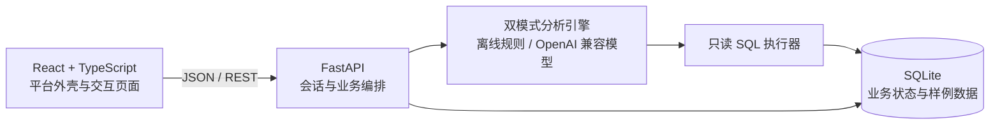

# GeniusQ DaaS Platform 智能问数优化设计说明

## 1. 文档目的

本设计用于指导两项交付物的制作：

1. `智能问数优化实施计划书.md`：面向产品、研发和验收人员说明问题、方案、排期、风险与验收指标。
2. 可在 Windows 本地运行的演示系统：在不修改 GeniusQ DaaS Platform 源码的前提下，以独立前后端项目完整展示石墨文档“智能问数优化需求 0714”中的关键能力。

本设计采用逐项追踪方式。每个页面、接口和自动化测试均标注石墨需求编号，使计划书、Demo 与原始需求可以互相核对。

## 2. 已确认边界

- Demo 采用 React + TypeScript 前端、FastAPI 后端和 SQLite 本地数据库。
- Demo 保留现有GeniusQ DaaS Platform 的深色顶栏、蓝色激活态、左侧模块导航和数据工作台视觉结构。
- 数据建模、数据呈现、数据管理等模块仅提供一致的平台导航与说明页；智能问数和知识库管理为可操作核心模块。
- 系统默认完全离线运行；配置 OpenAI 兼容的模型地址和密钥后，可以切换真实模型。
- 离线模式不是静态截图：会真实调用本地 API、查询 SQLite、维护会话、执行查重与同步规则，并保存仪表盘状态。
- Demo 使用内置房地产、人口和通勤样例数据，不连接公司生产数据库。
- 只支持只读 SQL。服务端拒绝写入、建表、删表和多语句执行，并限制表范围、返回行数与执行时间。
- Demo 不实现生产级身份认证、多人实时协作、真实定时任务调度、生产数据连接器和GeniusQ DaaS Platform 源码合并。

## 3. 方案选择

### 3.1 采用方案

采用 React + TypeScript + FastAPI + SQLite 的独立全栈 Demo。

选择理由：该方案在 UI 还原、前后端边界、真实数据处理和本地运行之间最平衡。它可以证明需求具备工程可行性，同时不依赖公司环境或外部服务。

### 3.2 未采用方案

- Streamlit 单体方案开发较快，但难以还原现有平台导航、工作台、思考轨迹和仪表盘交互。
- React 纯前端方案视觉表现良好，但知识库同步、SQL 安全、查重与多源执行只能做成浏览器模拟，无法证明后端方案。

## 4. 产品信息架构

```text
GeniusQ DaaS Platform 平台外壳
├── 数据建模（说明页）
├── 数据呈现（说明页）
├── 智慧问数
│   ├── 智能问数工作台
│   ├── 会话历史
│   └── 我的仪表盘
├── 数据管理（说明页）
├── 知识库管理
│   ├── 知识条目
│   ├── 数据表同步
│   ├── SQL 模型
│   ├── 标签与检索
│   └── 同步日志
└── 需求映射
```

“需求映射”页面列出石墨条目、原始问题、解决方案、对应页面、对应接口、验收动作和实现状态。智能问数和知识库页面上的功能卡片显示可点击的需求编号徽标，点击后跳转到该映射条目。

## 5. 系统架构



### 5.1 前端职责

- 复刻平台导航与布局。
- 管理智能问数、知识库、仪表盘和需求映射的展示状态。
- 轮询分析步骤并呈现执行进度。
- 使用 ECharts 将后端返回的图表规范渲染为折线图、柱状图、饼图和数据表。
- 不在浏览器内生成 SQL、执行查重或保存密钥。

### 5.2 后端职责

- 管理会话上下文与分析任务。
- 将用户问题规范化为分析意图，判断信息是否完整。
- 选择离线规则引擎或真实模型适配器。
- 校验并执行只读 SQL。
- 生成数据来源、结论、下一步问题和图表规范。
- 管理知识条目、查重、优先级、关联关系和同步日志。
- 持久化仪表盘与卡片布局。

### 5.3 双模式分析引擎

系统通过统一的 `AnalysisEngine` 接口隔离两种实现：

- `OfflineAnalysisEngine`：识别内置演示意图，生成确定性的分析计划、参数化 SQL、图表与结论。所有验收用例在无网络状态下可重复运行。
- `OpenAICompatibleAnalysisEngine`：从环境变量读取 `LLM_BASE_URL`、`LLM_API_KEY` 和 `LLM_MODEL`，要求模型输出结构化分析计划。输出仍须经过相同的 SQL 安全校验和结果生成流程。

真实模型调用失败时，不自动把未验证的文本当作查询执行。页面提示失败原因并提供“切换离线演示模式”和“重试”操作。

## 6. 核心数据

### 6.1 演示业务数据

- `house_price_monthly`：行政区、月份、平均房价、环比和同比。
- `housing_transactions`：行政区、月份、成交套数和成交面积。
- `district_population`：行政区、年份、常住人口和人口增速。
- `commuting_metrics`：行政区、年份、平均通勤时间和跨区通勤比例。

这些表覆盖：单表趋势分析、两表关联分析、跨房地产与人口通勤两个数据源的综合问题。

### 6.2 应用状态数据

- `conversations`、`messages`、`analysis_runs`、`analysis_steps`：保存会话、消息、任务和思考步骤。
- `knowledge_items`、`knowledge_links`、`knowledge_tags`：保存文本、SQL、规则及其数据表关系。
- `sync_jobs`、`sync_logs`：保存手动与模拟定时同步记录。
- `dashboards`、`dashboard_cards`：保存图表配置、布局和分享标识。
- `requirement_mappings`：保存石墨需求与页面、接口、测试的追踪关系。

## 7. 核心交互设计

### 7.1 智能问数完整旅程

1. 用户提交问题。系统恢复同一会话的时间、地域、指标和数据集上下文。
2. 若问题缺少必要条件，系统不执行 SQL，而是显示自然语言澄清提示和三条可点击推荐问题。
3. 信息完整时，页面逐步展示意图识别、数据表选择、字段与时间范围、模型或 Skill 调用、SQL 规划、执行和结果生成。
4. 单源问题生成一条 SQL；跨源问题生成多个只读子查询，分别执行后由汇总器合并指标和结论。
5. 页面同时展示结果表格、推荐图表、最大值、趋势、异常点、数据来源、更新时间和置信度。
6. 用户可切换图表类型、复制 SQL、发起推荐追问或把当前图表加入仪表盘。
7. 仪表盘支持卡片移动、尺寸切换、刷新、移除和生成本地分享链接。

### 7.2 知识库管理旅程

1. 用户创建文本、SQL 或规则类知识，可关联数据表并添加标签。
2. 服务端对名称、规范化文本、规范化 SQL、数据源和规则生成指纹。
3. 同一知识库内发现重复时阻止重复创建并定位现有条目。
4. 私有库与公开库存在相同内容时保留两条记录，但问数检索始终优先私有条目，并在页面显示覆盖关系。
5. 数据表可手动同步；“模拟定时同步”触发一次与定时任务相同的同步逻辑并写入日志。
6. 删除演示数据表时，页面先列出受影响知识；用户确认后执行表状态删除和知识联动删除。
7. 用户可按标签、类型、范围和关键词筛选，并从知识详情查看文本/SQL与数据表的双向关系。

## 8. API 边界

| 方法与路径 | 作用 | 主要需求 |
|---|---|---|
| `POST /api/conversations` | 创建会话 | 2.3 |
| `POST /api/chat` | 提交问题，返回回答或澄清建议 | 2.1、2.2、2.3、5 |
| `GET /api/analysis/{id}` | 获取步骤、SQL、来源、结果与结论 | 2.1、2.4、2.5、5 |
| `GET /api/knowledge` | 检索和筛选知识条目 | 3.4 |
| `POST /api/knowledge` | 新建带关联关系的知识 | 3.2、3.4 |
| `DELETE /api/knowledge/{id}` | 删除知识条目 | 3.3、3.4 |
| `POST /api/knowledge/deduplicate` | 返回重复项、覆盖关系和优先级 | 3.2 |
| `POST /api/sync` | 执行手动或模拟定时同步 | 3.3 |
| `GET /api/sync/logs` | 查询同步历史 | 3.3 |
| `POST /api/dashboards` | 创建仪表盘 | 2.6 |
| `POST /api/dashboards/{id}/cards` | 保存分析图表 | 2.4、2.6 |
| `PATCH /api/dashboards/{id}/layout` | 保存卡片布局 | 2.6 |
| `GET /api/requirements` | 获取完整需求追踪矩阵 | 全部 |

所有错误使用统一结构：`code`、`message`、`action`、`request_id`。开发日志可记录堆栈，浏览器响应不包含数据库连接串、密钥或内部文件路径。

## 9. 石墨需求追踪矩阵

| 需求编号 | 原始功能点 | Demo 解决方案 | 页面与验收动作 |
|---|---|---|---|
| 2.1-a | 展示具体处理过程 | 任务步骤模型和可折叠时间线 | 提交完整问题，展开每个思考步骤 |
| 2.1-b | 关联数据并展示表名、更新时间、字段、时间范围、置信度 | 数据来源侧栏和分析元数据 | 查看来源卡片并跳转数据表详情 |
| 2.1-c | 展示关联模型和分析步骤，模型做成 Skill | 模型/Skill 调用步骤与离线分析技能 | 查看“趋势与异常检测 Skill”调用记录 |
| 2.2 | 问题不完整时自动推荐相关问题 | 完整性判定器和推荐问题组件 | 输入“分析房价”，点击推荐的时间范围问题 |
| 2.3 | 支持多轮对话和连续追问 | 会话上下文存储 | 首问 2025 年房价，再追问“只看海淀区” |
| 2.4-a | 自动生成图表并发布，支持多图表组合 | 图表规范、类型切换和加入仪表盘 | 生成图表，切换类型并加入仪表盘 |
| 2.4-b | 自动输出最大值、趋势和异常点等有价值结论 | 确定性洞察计算器 | 查看结果上方的总结卡片 |
| 2.5 | 从结果继续深入分析并推荐下一步问题 | 基于结果元数据生成推荐追问 | 点击“继续分析异常区域成交量” |
| 2.6 | 保存仪表盘、多图表组合、拖拽布局、更新、分享与发布 | 仪表盘卡片持久化和本地分享视图 | 移动卡片、刷新并打开分享链接 |
| 3.2 | 自动查重；同库不重复；私有优先；私有可补充说明 | 指纹查重和覆盖关系 | 创建重复知识并查看冲突处理 |
| 3.3 | 公开库定义、入库同步、定时同步和删除联动 | 数据表同步服务和模拟调度入口 | 手动同步、模拟定时同步、确认删除联动 |
| 3.4-a | 标签分类、筛选与检索 | 标签、多条件筛选和全文检索 | 按“房价”和“SQL”组合筛选 |
| 3.4-b | 文本与数据表建立关联并可查看 | `knowledge_links` 双向关系 | 从文本知识打开关联表详情 |
| 3.4-c | SQL 与数据表建立关系；SQL 变化时自动提示调整 | SQL 表名提取和失效状态 | 修改模拟表结构，查看 SQL 待调整提示 |
| 5 | 多源知识学习；将综合问题拆为多个 SQL 并汇总结果 | 多源规划器、子查询执行器和结果汇总器 | 提问“房价上涨是否与人口和通勤相关” |

## 10. 页面状态与错误处理

- **执行中**：显示当前步骤、总步骤和每个跨源子查询状态，允许取消尚未完成的演示任务。
- **需要补充**：指出缺失的时间、地域或指标，提供三条可点击推荐问题，不生成 SQL。
- **无匹配数据**：展示已使用的筛选条件，允许放宽时间或地域范围。
- **SQL 被拒绝**：说明触发的只读安全规则，不展示底层解析器堆栈。
- **模型不可用**：提供重试和切换离线模式按钮，不丢失当前输入。
- **同步冲突**：展示公开与私有条目的差异、最终优先级和可执行操作。
- **完成**：展示耗时、数据来源、更新时间、置信度、SQL、图表和结论。

## 11. 测试设计

### 11.1 后端测试

- 多轮上下文可以继承时间范围和地域，并允许新一轮显式覆盖。
- 不完整问题返回澄清建议且不执行 SQL。
- SQL 安全器允许单条 `SELECT`/`WITH` 查询，拒绝 DDL、DML 和多语句。
- 多源规划生成两个或更多子查询并合并为统一结果。
- 同一知识库指纹重复时拒绝创建；私有与公开重复时返回私有优先关系。
- 手动同步和模拟定时同步使用同一业务函数并产生同步日志。
- 数据表删除联动仅在确认后执行，并删除对应知识关系。
- 仪表盘保存后重新读取可恢复卡片顺序、尺寸和图表配置。

### 11.2 前端测试

- 思考过程可展开和收起，并显示数据来源与需求编号。
- 推荐问题点击后填充并提交新问题。
- 图表类型切换保留原始数据。
- “加入仪表盘”成功后显示明确反馈。
- 知识冲突页显示私有优先和公开条目被覆盖状态。
- 需求映射页可按模块和优先级筛选。

### 11.3 端到端验收

1. 从“分析 2024—2025 年各行政区房价变化”开始，完成思考过程、SQL、图表、结论、推荐追问和加入仪表盘。
2. 先问 2025 年房价，再问“只看海淀区”，验证连续追问使用上轮上下文。
3. 提问“房价上涨是否与人口和通勤相关”，验证多 SQL 执行和汇总结论。
4. 创建重复知识，验证同库阻止重复及私有覆盖公开的优先级。
5. 执行同步和删除联动，验证日志与关联关系状态。

## 12. 本地运行与交付结构

项目提供：

- 根目录 `README.md`：系统介绍、目录结构、运行方式、演示脚本和常见问题。
- `.env.example`：模型模式、兼容接口地址、模型名和密钥占位项。
- `start-demo.ps1`：检查依赖、初始化数据库、启动 FastAPI 与 Vite，并打开浏览器。
- `backend/`：FastAPI 应用、数据库初始化、领域服务和 Pytest 测试。
- `frontend/`：React 应用、组件、页面和 Vitest 测试。
- `docs/智能问数优化实施计划书.md`：正式计划书。
- `docs/需求追踪矩阵.md`：便于评审时独立查看的需求对应表。

Windows 当前 PowerShell 执行策略可能阻止 `npm.ps1`，启动脚本统一调用 `npm.cmd`，避免要求用户修改系统执行策略。

## 13. 完成标准

- 在未配置任何模型密钥且断网的情况下，可使用 `start-demo.ps1` 启动并完成五条端到端演示路径。
- 智能问数与知识库管理的所有核心按钮均调用真实本地 API，不使用仅打印日志的空操作。
- 石墨需求矩阵中的每一项均有页面入口、API 或领域服务实现以及明确验收动作。
- 后端测试、前端测试和前端生产构建全部通过。
- README 和计划书中的启动命令在干净的本地环境按顺序可执行。
- 页面视觉结构与用户提供的GeniusQ DaaS Platform 截图一致，但不复制公司专有源代码或生产数据。
