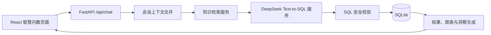

# GeniusQ DaaS Platform DeepSeek Text-to-SQL 增强设计说明

## 1. 文档目的

本文档基于 `2026-07-14-intelligent-query-optimization-design.md` 进行增量设计，目标是指导下一阶段开发：将当前“离线规则驱动的智能问数 Demo”升级为“真实大模型驱动的 Text-to-SQL 问数能力”。

本阶段优先完成 A 方向：参考 Vanna 的训练与 Text-to-SQL 思路，引入 DeepSeek API、知识检索、SQL 生成、SQL 安全校验和反馈沉淀。Data Formulator 的交互式数据探索特色仅保留轻量入口：模型可返回图表建议，用户可在多轮对话中要求调整图表或查询条件；不在本阶段实现完整的数据探索工作台。

## 2. 当前项目基础

当前项目已经具备以下可复用能力：

- React + TypeScript 前端、FastAPI 后端、SQLite 本地数据库。
- `OfflineAnalysisEngine` 可根据固定规则生成分析计划、SQL、图表配置和洞察。
- `sql_guard.py` 已支持只读 SQL 校验，拒绝 DDL、DML、多语句和未授权表。
- `knowledge_items`、`data_tables` 和知识库页面已经具备知识创建、筛选、去重、关联表和同步日志能力。
- 智慧问数页面已经能展示思考步骤、SQL、数据来源、图表、表格、洞察、追问和保存到仪表盘。
- 仪表盘已经支持图表保存、两列布局、拖拽排序和分享查看。

因此，本阶段不重建平台，而是在现有 `AnalysisEngine`、知识库和图表体系之上新增真实 LLM 分析链路。

## 3. 设计边界

### 3.1 本阶段实现

- 新增 DeepSeek API 配置位和运行模式。
- 新增 Text-to-SQL 服务，负责调用 DeepSeek 并解析结构化结果。
- 新增知识检索服务，从现有知识库和数据表元数据中挑选与问题相关的上下文。
- 将 `/api/chat` 的分析流程扩展为：上下文合并、知识检索、Prompt 构造、DeepSeek 生成 SQL、SQL 安全校验、查询执行、图表渲染。
- 前端展示本轮使用的知识来源、模型模式、生成 SQL、SQL 校验状态和图表建议。
- 保留 offline fallback，DeepSeek 不可用时不会破坏原有演示路径。
- 预留用户反馈沉淀入口，把“正确 SQL / 错误 SQL / 收藏为示例”作为后续训练材料。

### 3.2 本阶段不实现

- 不提交真实 DeepSeek API Key。
- 不引入向量数据库、Embedding 服务或 ChromaDB。
- 不实现文件上传训练。
- 不生成或执行 Python 脚本。
- 不实现完整 Data Formulator 式拖拽数据探索工作台。
- 不连接公司生产数据库。
- 不绕过现有 SQL 安全校验。

## 4. 运行模式

系统支持两种模式：

```text
LLM_MODE=offline
```

默认模式，继续使用当前 `OfflineAnalysisEngine`。该模式不依赖网络和 API Key，适合稳定演示和自动化测试。

```text
LLM_MODE=deepseek
DEEPSEEK_API_KEY=your_api_key_here
DEEPSEEK_BASE_URL=https://api.deepseek.com/v1
DEEPSEEK_MODEL=deepseek-chat
```

DeepSeek 模式，系统会检索知识库并调用 DeepSeek 生成 SQL。真实 Key 只放在本地 `.env`，不写入代码、不写入 README 示例中的真实值、不提交到 Git。

兼容性策略：

- 如果 `LLM_MODE=deepseek` 但缺少 `DEEPSEEK_API_KEY`，后端返回明确错误，并提示配置 Key 或切回 offline。
- 如果 DeepSeek 调用超时、返回非 JSON 或生成 SQL 未通过安全校验，系统不执行 SQL。
- 如果用户选择 fallback，可以由前端提示切换 offline 模式，或者后端按配置决定是否自动回退。第一阶段建议不自动静默回退，避免演示时误以为使用了真实模型。

## 5. 目标架构



核心原则：

- LLM 只负责生成候选 SQL、解释和图表建议。
- SQL 是否能执行由后端安全层决定。
- 结果洞察可以由后端确定性计算，也可以展示模型解释，但不能把模型解释当作数据库事实。
- 所有可复用训练材料沉淀到现有知识库体系中。

## 6. 后端设计

### 6.1 配置扩展

扩展 `backend/app/config.py`：

```python
class Settings(BaseSettings):
    database_url: str = "sqlite:///./daas_demo.db"
    llm_mode: str = "offline"
    query_row_limit: int = 500

    deepseek_api_key: str = ""
    deepseek_base_url: str = "https://api.deepseek.com/v1"
    deepseek_model: str = "deepseek-chat"
    deepseek_timeout_seconds: int = 30
```

保留原有 `llm_base_url`、`llm_api_key`、`llm_model` 可选兼容字段，但新开发优先使用 DeepSeek 专用字段，避免含义混乱。

### 6.2 新增数据模型

扩展 `backend/app/schemas.py`，新增：

```python
class RetrievedKnowledge(BaseModel):
    id: str
    title: str
    kind: str
    scope: str
    content: str
    linked_tables: list[str]
    score: float


class TextToSqlResult(BaseModel):
    sql: str
    reasoning: str
    chart: ChartSpec | None = None
    confidence: float | None = None
    used_knowledge_ids: list[str] = []
    raw_model_output: dict[str, Any] | None = None
```

`raw_model_output` 仅用于开发调试和服务端日志，不直接完整展示给普通用户。

### 6.3 知识检索服务

新增文件：

```text
backend/app/services/retrieval.py
```

第一阶段采用关键词检索，不引入向量库。

检索输入：

- 用户问题；
- 当前会话上下文；
- 可用数据表；
- 知识库条目。

检索信号：

- 问题中出现的表名、字段名、业务词；
- 知识标题、内容、标签、关联表；
- 私有知识优先于公开知识；
- SQL 示例优先级高于普通文本说明；
- 与当前数据表状态不可用的知识降权或排除。

返回结果：

- 最多 5 条知识；
- 每条包含标题、类型、关联表、摘要内容、匹配分数；
- 用于 Prompt，也用于前端展示“本次使用知识”。

### 6.4 DeepSeek Text-to-SQL 服务

新增文件：

```text
backend/app/services/text_to_sql.py
```

职责：

1. 构造 Prompt。
2. 调用 DeepSeek Chat Completions API。
3. 要求模型返回严格 JSON。
4. 从结果中提取 SQL、解释、图表建议和置信度。
5. 对模型输出做基础格式校验。
6. 将 SQL 交给 `sql_guard.py`，不直接执行。

Prompt 结构：

```text
你是企业数据平台的 Text-to-SQL 助手。

数据库类型：SQLite

可用表结构：
...

业务口径和知识：
...

示例 SQL：
...

当前会话上下文：
...

用户问题：
...

要求：
1. 只返回 JSON，不要输出 Markdown。
2. SQL 必须是单条 SELECT 或 WITH 查询。
3. 只能使用提供的表和字段。
4. 不允许 INSERT、UPDATE、DELETE、DROP、ALTER、CREATE。
5. 如果问题缺少关键条件，返回 needs_clarification=true 和 suggestions。
6. 如果可以查询，返回 sql、reasoning、chart_suggestion、confidence。
```

期望输出：

```json
{
  "needs_clarification": false,
  "sql": "SELECT month, district, avg_price FROM house_price_monthly WHERE month LIKE '2025-%' ORDER BY month, district",
  "reasoning": "用户希望查看 2025 年各区房价趋势，需要按月份和区域读取平均房价。",
  "chart_suggestion": {
    "type": "line",
    "x_field": "month",
    "y_fields": ["avg_price"],
    "title": "2025年各区房价趋势"
  },
  "confidence": 0.82,
  "suggestions": []
}
```

### 6.5 AnalysisEngine 扩展

新增：

```text
DeepSeekAnalysisEngine
```

它实现现有 `AnalysisEngine` 协议，输出仍然是 `AnalysisPlan`。

分析流程：

1. 合并会话上下文。
2. 调用 `RetrievalService` 获取知识。
3. 调用 `TextToSqlService` 获取候选 SQL。
4. 如果模型要求澄清，返回 `needs_clarification=True`。
5. 如果模型给出 SQL，构造 `PlannedQuery`。
6. 在 `AnalysisPlan.metadata` 中记录：
   - `mode=deepseek`
   - `model=deepseek-chat`
   - `used_knowledge`
   - `sql_validation_status`
   - `confidence`
7. 后续 SQL 校验和执行继续复用 `conversation.py` 中已有流程。

### 6.6 Chat 编排调整

当前 `run_chat()` 默认使用 `OfflineAnalysisEngine`。

本阶段调整为：

```python
def select_analysis_engine(settings: Settings) -> AnalysisEngine:
    if settings.llm_mode == "deepseek":
        return DeepSeekAnalysisEngine(...)
    return OfflineAnalysisEngine()
```

`run_chat()` 不关心具体引擎，只消费 `AnalysisPlan`。

这样可以保持现有测试和前端结构稳定。

### 6.7 反馈沉淀

第一阶段新增轻量反馈接口：

```text
POST /api/analysis/{analysis_id}/feedback
```

请求示例：

```json
{
  "rating": "correct",
  "comment": "SQL 正确，可作为示例",
  "save_as_example": true
}
```

如果 `save_as_example=true`，后端将当前问题、SQL、图表配置和用户评论保存为一条 SQL 示例知识，供后续检索使用。

该功能先做简单闭环，不做复杂打分模型。

## 7. 前端设计

### 7.1 智慧问数页面增强

修改：

```text
frontend/src/pages/QueryWorkspace.tsx
```

新增展示信息：

- 当前模式：离线规则 / DeepSeek Text-to-SQL。
- 使用知识：显示本轮检索到的知识标题、类型和关联表。
- 生成 SQL：继续复用已有 SQL 展示。
- SQL 校验状态：通过 / 被拒绝 / 未执行。
- 模型解释：展示 `reasoning`。
- 置信度：显示模型置信度，仅作为参考，不等同于数据准确率。

### 7.2 图表建议

继续复用：

```text
frontend/src/components/AnalysisChart.tsx
```

DeepSeek 返回的 `chart_suggestion` 会转换成现有 `ChartSpec`：

- `line`
- `bar`
- `pie`
- `table`

如果模型返回未知图表类型，后端降级为 `table`，前端不直接崩溃。

### 7.3 反馈入口

在每次回答底部增加轻量按钮：

```text
SQL 正确
SQL 有问题
收藏为示例
```

用户点击后调用反馈接口。

第一阶段只需要明确反馈已保存，不需要做复杂反馈列表页面。

### 7.4 错误状态

前端需要处理：

- DeepSeek API Key 未配置；
- 模型请求超时；
- 模型输出无法解析；
- SQL 安全校验失败；
- 查询无数据；
- 模型建议图表字段不存在。

页面提示应面向用户：

```text
模型生成的 SQL 未通过安全校验，已阻止执行。你可以修改问题后重试，或切换离线演示模式。
```

不要展示 API Key、完整堆栈或内部路径。

## 8. API 变化

新增或扩展：

| 方法与路径 | 作用 |
|---|---|
| `GET /api/health` | 增加当前 `llm_mode`、模型可用性简要状态 |
| `POST /api/chat` | 在返回中增加 `mode`、`used_knowledge`、`model_reasoning`、`confidence`、`sql_validation_status` |
| `POST /api/analysis/{analysis_id}/feedback` | 保存用户反馈，可选沉淀为 SQL 示例知识 |

保持不变：

- `POST /api/conversations`
- `GET /api/analysis/{analysis_id}`
- 仪表盘相关接口
- 知识库 CRUD 接口
- SQL 安全执行规则

## 9. 数据库变化

优先复用现有表：

- `knowledge_items`：保存表结构说明、业务口径、示例 SQL、反馈沉淀知识。
- `analysis_runs`：保存每次分析结果。
- `messages`：保存会话消息。

建议新增一张反馈表：

```text
analysis_feedback
```

字段：

```text
id
analysis_id
rating
comment
save_as_example
created_at
```

是否沉淀为知识条目由 `save_as_example` 控制。

## 10. 安全设计

安全策略保持后端兜底：

- DeepSeek 生成的 SQL 一律视为不可信。
- 只有通过 `validate_read_only_sql()` 的 SQL 才允许执行。
- 仍只允许授权表：
  - `house_price_monthly`
  - `housing_transactions`
  - `district_population`
  - `commuting_metrics`
- 禁止多语句。
- 禁止 DDL / DML。
- 限制返回行数。
- 模型原始输出不直接进入浏览器完整展示。
- API Key 只从环境变量读取，不落库、不写日志、不返回前端。

## 11. 与 Data Formulator 特色的轻量融合

本阶段只吸收两个轻量特性：

1. 模型返回图表建议

   用户不需要手动选择图表，模型会根据问题建议折线图、柱状图或表格。

2. 多轮调整

   用户可以继续追问：

   ```text
   改成柱状图
   只看朝阳区和海淀区
   按涨幅排序
   ```

   后端将上一轮上下文、SQL、图表配置和当前问题一起传给 DeepSeek，让模型生成新的查询或图表建议。

完整的数据探索工作台、字段拖拽、分支历史和可视化画布作为第二阶段设计，不放入本阶段实现范围。

## 12. 测试设计

### 12.1 后端测试

- `LLM_MODE=offline` 时，现有离线问数测试继续通过。
- `LLM_MODE=deepseek` 且缺少 API Key 时，返回明确错误，不执行 SQL。
- DeepSeek mock 返回合法 JSON 时，系统生成 `AnalysisPlan`。
- DeepSeek mock 返回非法 JSON 时，系统返回模型输出解析错误。
- DeepSeek mock 返回危险 SQL 时，SQL 安全器拒绝执行。
- 检索服务能按问题关键词匹配房价、人口、通勤相关知识。
- 私有知识优先于公开知识。
- 反馈接口能保存反馈，并在 `save_as_example=true` 时创建 SQL 示例知识。

### 12.2 前端测试

- DeepSeek 模式下展示“当前模式”“使用知识”“模型解释”和“置信度”。
- SQL 被拒绝时展示安全提示，不渲染空白页面。
- 模型建议图表类型可切换折线、柱状和表格。
- 反馈按钮点击后显示保存成功。
- offline 模式下原有问答和仪表盘流程不受影响。

### 12.3 端到端验收

1. 配置 DeepSeek API Key 后，提问“分析 2025 年各区房价趋势”，系统检索房价知识、生成 SQL、执行查询并渲染图表。
2. 继续追问“只看朝阳区和海淀区”，系统继承上一轮上下文并生成新的 SQL。
3. 继续追问“改成柱状图”，系统保留数据语义并更新图表建议。
4. 故意让模型返回危险 SQL 的 mock 用例中，系统阻止执行并展示安全提示。
5. 点击“收藏为示例”，该问题和 SQL 被保存为知识库中的 SQL 示例。

## 13. 文档与交付

需要同步更新：

- `.env.example`：增加 DeepSeek 配置占位项。
- `README.md`：增加 DeepSeek 模式配置说明，强调不要提交真实 Key。
- `docs/智能问数优化实施计划书.md`：如果需要交付新版计划书，可补充“真实模型增强路线”章节。
- 自动化测试：增加 DeepSeek mock，不在测试中调用真实 API。

## 14. 完成标准

- 未配置 Key 时，项目仍能以 offline 模式稳定运行。
- 配置 DeepSeek Key 后，智能问数可以通过真实模型生成只读 SQL。
- DeepSeek 输出必须经过 SQL 安全校验，危险 SQL 不会执行。
- 前端可以展示模型模式、知识来源、SQL、图表建议和反馈入口。
- 用户反馈可以保存，并可选择沉淀为 SQL 示例知识。
- 后端单元测试、前端单元测试和构建通过。
- README 与 `.env.example` 中只包含占位配置，不包含真实 API Key。

