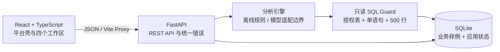

# 极智 DAAS 智能问数优化实施计划书

> 文档版本：V1.0  
> 编制日期：2026-07-14  
> 适用范围：实习交付评审、本地 Demo 演示、后续真实平台集成评估

## 1. 项目背景

极智 DAAS 是公司面向数据资产使用场景建设的平台，能够基于授权数据生成智能问数助手，并支持将用户 SQL 或 Python 脚本沉淀为可复用模型。现有“智能问数优化需求 0714”聚焦三个方向：让分析过程可理解、让追问与图表形成连续工作流、让知识与数据表之间建立可管理的关联。

本项目交付两类成果：一份可用于产品和研发评审的实施计划书；一个不修改极智 DAAS 源码、可在 Windows 本地运行的全栈 Demo。Demo 使用确定性样例数据复刻平台信息架构与关键交互，用于证明需求具备工程可行性，并为后续真实平台改造提供接口和验收基线。

## 2. 现状问题

1. **过程不透明**：用户只看到结果，难以确认使用了哪些表、字段、模型/Skill、时间范围和安全规则。
2. **问题不完整时缺少引导**：时间、区域或指标缺失会导致回答不稳定，缺少可直接点击的补全问题。
3. **分析链路易中断**：多轮上下文、推荐追问、图表切换、仪表盘保存和分享尚未形成闭环。
4. **知识治理不足**：相同知识可能重复入库，公开/私有冲突缺少明确优先级，文本/SQL 与数据表关系不够直观。
5. **同步与删除缺少审计**：手动同步、定时同步、结构变化和删除联动的影响范围需要可预览、可追溯。
6. **多源问题缺少统一编排**：涉及房价、人口、通勤等多源数据时，需要拆分多个只读查询，再按共同维度汇总。

## 3. 建设目标

### 3.1 产品目标

- 将“问问题—补全条件—执行分析—解释结果—继续追问—保存分享”串成完整旅程。
- 用可审计业务步骤替代黑盒展示，不暴露模型隐藏链路推理。
- 建立知识条目、SQL 模型、标签、数据表和同步日志之间的可视化关系。
- 用需求编号贯穿页面、API、自动化测试与演示脚本，降低评审沟通成本。

### 3.2 工程目标

- 默认 `LLM_MODE=offline`，在无网络、无密钥条件下稳定重复演示。
- 只允许单条 `SELECT`/`WITH`，限制授权表与 500 行返回上限。
- 所有会话、分析、知识、同步和仪表盘状态落本地 SQLite。
- 保留 OpenAI 兼容模型接入边界，浏览器永不接触模型密钥。

### 3.3 成功指标

- 15 个原始需求均能在“需求映射”页定位到页面与验收动作。
- 五条端到端旅程可自动运行，后端、前端单元测试全部通过。
- 本地首次启动只需一个 PowerShell 命令，健康检查在 30 秒内完成（依赖下载时间除外）。
- 非法 SQL、重复知识和未确认的数据表删除均被明确拒绝，并返回可执行建议。

## 4. 需求范围

### 4.1 本期范围

- 智能问数：2.1-a、2.1-b、2.1-c、2.2、2.3、2.4-a、2.4-b、2.5。
- 仪表盘：2.6。
- 知识库管理：3.2、3.3、3.4-a、3.4-b、3.4-c。
- 多源知识学习与多 SQL 汇总：5。
- 完整平台外壳、需求追踪页、本地样例数据、自动化测试和一键启动。

### 4.2 非目标

- 不修改、合并或发布公司极智 DAAS 生产源码。
- 不接入生产数据库、真实账号、统一认证或多人实时协作。
- 不执行写入型 SQL，不运行用户 Python 脚本，不实现真实定时调度器。
- “模拟定时同步”仅复用真实同步服务入口并写入审计日志，不声明已部署生产调度。

## 5. 总体方案

采用“独立全栈 Demo + 需求追踪矩阵”的方案：React/TypeScript 负责平台壳与交互，FastAPI 负责会话编排和领域规则，SQLite 同时保存样例业务数据与应用状态。

与 Streamlit 单体方案相比，该方案能更准确复刻 DAAS 导航、工作台和卡片交互；与纯前端静态稿相比，它能真实验证 SQL 安全、会话持久化、知识查重、同步审计、删除联动和仪表盘布局保存。

本地 Demo 已完成：独立分支中已经实现并自动验证核心页面与 API。真实平台集成建议：以本计划的四周排期为参考，在公司代码库中逐模块接入，而不是直接复制 Demo 的样例数据和本地身份假设。

## 6. 功能方案

### 6.1 智能问数工作台

1. 创建会话并保存时间、区域、指标上下文。
2. 对“分析房价”等不完整问题返回三条补全建议，不生成 SQL（2.2）。
3. 完整问题展示意图确认、数据表/字段选择、Skill 调用、SQL 校验执行和结果生成（2.1-a、2.1-b、2.1-c）。
4. 输出来源、更新时间、置信度、字段、只读 SQL、表格/图表、最大值、趋势和异常提示（2.4-a、2.4-b）。
5. 支持连续追问与显式覆盖上下文（2.3），并给出下一步推荐问题（2.5）。
6. 将当前图表保存到仪表盘（2.6）。

### 6.2 多源分析

对于“房价上涨是否与人口和通勤相关”等问题，规划器生成房产子查询与人口通勤子查询，分别通过相同 SQL 安全防线，按行政区对齐后给出综合解释，同时提示“相关不等于因果”（5）。

### 6.3 知识库管理

- 以规范化内容、SQL 和关联表生成 SHA-256 指纹；同库重复返回冲突，跨库允许共存（3.2）。
- 私有知识覆盖匹配的公开知识，同时保留两条记录和覆盖关系（3.2）。
- 支持关键词、类型、范围和标签组合筛选（3.4-a）。
- 文本/SQL 条目展示关联数据表；SQL 自动抽取 `FROM/JOIN` 表名，并保存结构状态（3.4-b、3.4-c）。
- 手动同步和模拟定时同步共用服务，写入统一审计日志（3.3）。
- 删除数据表前返回受影响知识；确认后在一个事务中标记表不可用并移除关联知识（3.3）。

### 6.4 仪表盘与需求追踪

- 卡片和布局持久化到 SQLite，使用 12 列坐标呈现放大、恢复、移动、刷新和移除，并提供可打开的本地只读分享页（2.6）。
- `/api/requirements` 保存全部 15 个需求条目，前端支持模块/优先级筛选和验收动作展开。

## 7. 技术架构

### 7.1 前端职责

- 复刻深色顶栏、蓝色激活态、左侧导航、中央工作区和浅灰背景。
- 管理输入、加载、澄清、完成、错误和确认等页面状态。
- 渲染业务步骤、来源、SQL、图表、洞察、知识关系、同步日志和看板布局。
- 不生成 SQL，不保存模型密钥，不绕过后端规则。

### 7.2 后端职责

- 合并会话上下文并选择分析意图。
- 校验/执行只读 SQL，组装数据集、洞察和图表规范。
- 实现知识指纹、优先级、关联、同步与删除联动。
- 持久化仪表盘与需求映射；统一错误包含 `code`、`message`、`action`、`request_id`。

### 7.3 核心数据表

- 业务样例：`house_price_monthly`、`housing_transactions`、`district_population`、`commuting_metrics`。
- 问数状态：`conversations`、`messages`、`analysis_runs`。
- 知识治理：`knowledge_items`、`data_tables`、`sync_logs`。
- 仪表盘：`dashboards`、`dashboard_cards`。
- 需求追踪：`requirement_mappings`。

## 8. 数据与安全

1. Demo 仅使用北京六个行政区的确定性虚构数据，不连接生产库。
2. SQL 必须以 `SELECT` 或 `WITH` 开始；拒绝 DDL、DML、`PRAGMA`、`ATTACH` 和多语句。
3. SQL 只能访问四张白名单表，结果最多 500 行；用户区域输入来自固定行政区词表。
4. 模型凭证仅由后端环境变量读取；日志、API 错误和浏览器响应不包含密钥、数据库连接串或内部路径。
5. 删除操作先预览影响范围，用户确认后才执行关联状态修改。
6. “思考过程”是业务执行审计，不记录或输出模型隐式推理。

## 9. 实施阶段与排期

下表是**真实平台集成建议**的四周参考排期；本地 Demo 已完成，不将此排期误表述为已经发生的生产改造。

| 周次 | 目标 | 主要工作 | 周交付与退出条件 |
|---|---|---|---|
| 第 1 周 | 需求基线与数据契约 | 核对 15 项需求；确认数据表、权限、会话和错误协议；接入只读查询沙箱 | 接口契约、威胁清单、样例数据与后端基础测试通过 |
| 第 2 周 | 智能问数闭环 | 上下文、澄清、步骤、数据血缘、Skill、图表规范、洞察和推荐追问 | 2.1–2.5 与 5 的 API/页面联调通过 |
| 第 3 周 | 知识与仪表盘 | 指纹查重、私有优先、关联、同步、删除联动、看板布局与分享 | 2.6、3.2–3.4 的自动化用例通过 |
| 第 4 周 | 验收与灰度 | 性能/安全回归、真实模型适配、埋点、用户演示、缺陷收敛 | 五条端到端旅程通过，需求矩阵签字，具备灰度条件 |

建议每周设置一次产品/数据/研发联合评审；任一 P0 验收失败均不得进入下一阶段的生产发布。

## 10. 人员分工建议

| 角色 | 建议投入 | 主要职责 |
|---|---:|---|
| 产品/业务负责人 | 0.5 人 | 口径、优先级、演示脚本、验收签字 |
| 后端工程师 | 1–2 人 | 会话编排、模型适配、SQL Guard、知识与看板 API |
| 前端工程师 | 1 人 | 平台壳、问数/知识/看板/追踪页面和可访问交互 |
| 数据工程师 | 0.5–1 人 | 数据表权限、元数据、口径与同步策略 |
| 测试/安全 | 0.5–1 人 | 自动化、越权/注入/删除联动、回归与验收证据 |

## 11. 风险与应对

| 风险 | 影响 | 应对措施 |
|---|---|---|
| 真实模型输出不稳定 | 生成不可执行 SQL 或字段不一致 | 强制结构化输出；后端二次校验；失败不执行；离线模式作为确定性验收基线 |
| 数据口径不一致 | 结果正确但业务解释错误 | 口径知识版本化；数据表/字段/更新时间/置信度随结果展示 |
| SQL 注入或越权 | 数据泄漏或破坏 | 单语句只读、关键词拦截、表白名单、行数/超时限制、服务账号最小权限 |
| 私有/公开知识冲突 | 使用错误口径 | 指纹查重；私有优先；页面明确显示覆盖关系并保留公开记录 |
| 删除或表结构变化 | SQL 模型失效 | 删除预览、确认联动、同步标记 `needs_review`、审计日志 |
| Demo 与生产架构差异 | 低估集成成本 | 将 Demo 定位为接口与验收基线；生产集成另行评估认证、权限、队列和监控 |
| 演示环境依赖失败 | 无法现场启动 | 一键脚本检查运行时、安装依赖、轮询健康；提供手动启动与重置说明 |

## 12. 验收方案

### 12.1 自动化验收

- 后端：数据库幂等种子、SQL Guard、离线分析、上下文、知识、同步、删除联动、仪表盘、需求与文档覆盖。
- 前端：需求徽标、澄清建议、思考步骤、保存图表、私有优先、同步、布局、需求筛选。
- 端到端：问题到图表到看板、多轮追问、多源拆分、知识冲突、同步与删除联动。

### 12.2 演示验收

1. 输入“分析房价”，必须返回三条建议且无 SQL（2.2）。
2. 完成房价分析，必须看到步骤、来源、Skill、SQL、图表、最大值/异常和追问（2.1、2.4、2.5）。
3. 追问“只看海淀区”，必须继承 2025 年和平均房价指标（2.3）。
4. 多源问题必须至少生成两条白名单 SQL 并汇总（5）。
5. 私有知识必须覆盖公开匹配项；同步和删除必须留痕并先确认（3.2–3.4）。
6. 图表加入看板后，刷新仍存在且布局变化可保存；复制的分享链接必须能打开只读看板且不出现编辑按钮（2.6）。

## 13. 需求追踪矩阵

| 编号 | 解决方案摘要 | Demo 页面 | 主要 API |
|---|---|---|---|
| 2.1-a | 可折叠业务步骤时间线 | 智能问数 | `POST /api/chat` |
| 2.1-b | 来源、表、字段、更新时间、置信度 | 智能问数 | `POST /api/chat` |
| 2.1-c | Skill 调用记录 | 智能问数 | `POST /api/chat` |
| 2.2 | 完整性判断和三条建议 | 智能问数 | `POST /api/chat` |
| 2.3 | SQLite 会话上下文 | 智能问数 | `POST /api/conversations`、`POST /api/chat` |
| 2.4-a | 图表规范、类型切换、加入看板 | 智能问数/仪表盘 | `POST /api/dashboards/{id}/cards` |
| 2.4-b | 最大值、趋势、异常洞察 | 智能问数 | `GET /api/analysis/{id}` |
| 2.5 | 推荐追问 | 智能问数 | `POST /api/chat` |
| 2.6 | 卡片布局、刷新、移除、分享 | 我的仪表盘 | `/api/dashboards/*` |
| 3.2 | 指纹查重、私有优先 | 知识库管理 | `POST /api/knowledge/deduplicate` |
| 3.3 | 同步审计、删除预览与确认 | 知识库管理 | `POST /api/sync`、`DELETE /api/data-tables/{name}` |
| 3.4-a | 标签与组合筛选 | 知识库管理 | `GET /api/knowledge` |
| 3.4-b | 文本—数据表双向关系 | 知识库管理 | `GET /api/knowledge/{id}` |
| 3.4-c | SQL 表名抽取与结构状态 | 知识库管理 | `POST /api/knowledge` |
| 5 | 多源拆分、多 SQL、按区域汇总 | 智能问数 | `POST /api/chat` |

逐项测试文件和具体验收动作见《需求追踪矩阵》。
