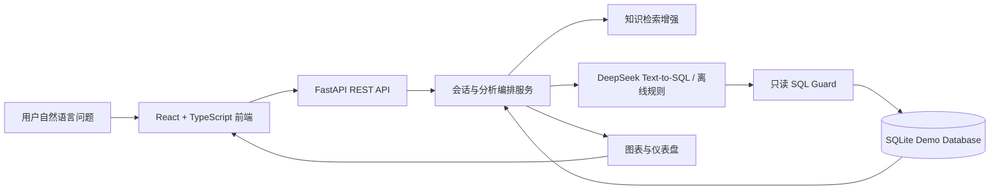

# GeniusQ DaaS 智能问数 Demo 实施计划书

> 文档版本：V2.0
> 更新日期：2026-07-20
> 适用范围：本地 Demo 演示、实习项目交付、后续平台化开发参考
> 项目定位：独立全栈原型，不直接修改或合并生产平台源码

## 1. 项目背景

GeniusQ DaaS 是面向企业数据资产使用场景建设的数据平台，核心目标是让业务用户可以通过自然语言查询授权数据，并将常见 SQL、分析逻辑或脚本沉淀为可复用模型。当前 Demo 围绕“智能问数”能力构建一个可本地运行的全栈原型，用于验证自然语言问数、Text-to-SQL、知识检索增强、图表分析、仪表盘沉淀和运行配置等关键链路。

本项目不接入真实生产数据库，也不修改 GeniusQ DaaS 生产源码。Demo 通过本地 SQLite 生成确定性的房价、成交、人口、通勤和知识库样例数据，复刻企业数据平台中的核心交互和工程边界，便于演示、评审和后续迁移设计。

## 2. 建设目标

### 2.1 产品目标

- 让用户可以用自然语言完成“提问 - 分析 - 图表 - 追问 - 保存看板”的完整流程。
- 让系统执行过程可观察：展示问题理解、上下文合并、知识检索、字段选择、SQL 生成、SQL 校验、查询执行和图表推荐等步骤。
- 支持 DeepSeek Text-to-SQL，同时保留本地离线规则兜底，保证无 API Key 时仍可演示。
- 支持数据源查看、知识库管理、仪表盘管理、历史会话管理和运行配置。
- 形成清晰的项目文档、README、测试用例和一键启动方式，便于交付和二次开发。

### 2.2 工程目标

- 前后端职责清晰：React 负责交互和可视化，FastAPI 负责编排、SQL 安全、数据访问和模型调用。
- 后端按 api / services / repositories / domain 分层，降低业务逻辑与数据库访问耦合。
- 前端拆分大型页面和图表组件，降低 QueryWorkspace、DashboardWorkspace、AnalysisChart 的维护成本。
- API Key 只在本地后端运行时使用，不在页面回显完整密钥，不提交到仓库。
- SQL 只允许只读查询，禁止 DDL、DML、PRAGMA、ATTACH、多语句和越权表访问。

## 3. 当前已实现功能

### 3.1 智能问数工作台

用户输入问题后，系统会创建一次分析任务，并按步骤展示执行过程。步骤会逐个出现并完成，呈现类似 Agent 工具调用的体验，但不会暴露模型隐藏推理链。

已实现能力：

- 自然语言问数。
- 问题过短或条件不足时，推荐 3 个可点击问题。
- 多轮会话上下文继承，例如继续限定年份、区域或指标。
- 知识库检索增强，优先使用业务口径、字段说明和 SQL 示例。
- DeepSeek Text-to-SQL 生成 SQL。
- SQL 只读安全校验。
- SQL 执行和结果集返回。
- 自动图表推荐和分析结论生成。
- 查询结果后的 3 个后续追问建议，避免与历史推荐重复。
- 历史会话自动保存，支持恢复、删除、清空；删除和清空均有二次确认。

### 3.2 数据源管理

数据源页面用于解释当前 Demo 可查询的数据结构，帮助用户理解“能问什么”和“每张表有哪些字段”。

已实现能力：

- 自动读取 SQLite 表结构。
- 展示字段名称、含义、类型、用途、示例值。
- 展示样例数据。
- 每张表生成可点击的推荐问题，并可跳转回智能问数页面。
- 数据库文件集中放在后端 data/runtime 目录中，避免根目录散乱。

当前演示数据表：

- `house_price_monthly`：房价月度指标。
- `housing_transactions`：住房成交指标。
- `district_population`：区域人口指标。
- `commuting_metrics`：通勤与就业指标。
- `knowledge_items`：知识库条目。
- `semantic_metrics`：语义指标库。
- `conversations` / `messages` / `analysis_runs`：会话和分析运行状态。
- `dashboards` / `dashboard_cards` / `share_links`：仪表盘和分享状态。

### 3.3 知识库管理

知识库用于增强 Text-to-SQL 的业务理解能力。模型生成 SQL 前，后端会检索相关知识，将业务口径、字段说明、SQL 示例等内容作为上下文。

已实现能力：

- 私有 / 公共知识条目管理。
- 按标签、类型、范围筛选。
- 知识与数据表关系维护。
- 重复内容识别。
- 私有知识优先级覆盖。
- 字段同步、模型同步和冲突提示。

### 3.4 DeepSeek Text-to-SQL 与离线兜底

系统支持两种模型模式：

- `offline`：默认模式，使用本地规则生成可演示的 SQL 和图表结果。
- `deepseek`：在线模式，调用 DeepSeek API 生成 SQL。

已实现能力：

- 页面内配置 API Key、Base URL 和 Model。
- 后端运行时保存配置，前端只展示脱敏 API Key。
- DeepSeek 默认配置已抽离到独立配置文件，便于后续替换模型服务。
- 连接测试支持错误分类：缺少 Key、超时、鉴权失败、限流、网络异常、服务异常。
- Text-to-SQL 失败时返回更明确的错误提示，并允许切回离线规则模式演示。

### 3.5 图表和仪表盘

问数结果可以保存到仪表盘，形成可持续查看的分析看板。

已实现能力：

- 新建多个仪表盘。
- 仪表盘支持自定义名称和重命名。
- 重命名时校验空名称和重复名称。
- 两列看板布局。
- 卡片拖拽排序，并提供蓝色虚线占位提示。
- 图表类型切换：折线图、柱状图、饼图、散点图、堆叠柱状图、表格。
- 年份、区域、指标筛选器。
- 卡片刷新、放大、移除。
- 本地只读分享页。

### 3.6 项目文档和测试

当前项目已包含 README、设计文档、实施计划书和自动化测试。

已实现验证：

- 后端测试覆盖 SQL Guard、会话历史、DeepSeek 错误分类、数据源、知识库、仪表盘 API。
- 前端测试覆盖智能问数、历史会话、图表切换、数据源推荐问题、仪表盘创建/重命名、运行配置和分享页。
- 前端生产构建通过。

## 4. 技术架构



### 4.1 前端架构

前端使用 React + Vite + TypeScript，页面按业务工作区组织：

- `QueryWorkspace`：智能问数主页面。
- `DataSourceWorkspace`：数据源管理。
- `KnowledgeWorkspace`：知识库管理。
- `DashboardWorkspace`：仪表盘管理。
- `SettingsWorkspace`：DeepSeek API 配置。
- `SharedDashboardPage`：只读分享页。

近期重构重点：

- QueryWorkspace 拆出模型配置 hook、仪表盘保存 hook 和输入组件。
- AnalysisChart 拆出图表类型、数据转换和图表配置。
- 图表样式从全局 CSS 拆出到独立样式文件。
- 前端模型默认配置抽离到 `frontend/src/config/modelDefaults.ts`。

### 4.2 后端架构

后端使用 FastAPI + SQLAlchemy，按以下层次组织：

- `api/`：HTTP 路由和响应模型。
- `services/`：业务流程、会话编排、知识检索、SQL 校验、仪表盘服务。
- `repositories/`：数据库访问层，隔离 SQLAlchemy 查询。
- `domain/`：业务域配置和模型默认配置。
- `db.py`：数据库连接和 session 管理。
- `seed.py`：演示数据库初始化和样例数据生成。

近期重构重点：

- 新增 `repositories/conversations.py`，承接会话删除、清空、存在性检查等数据访问逻辑。
- 新增 `repositories/dashboards.py`，承接仪表盘查询、分享标识查询、名称重复校验等数据访问逻辑。
- Settings API 使用更明确的响应模型，减少宽泛的 `dict[str, Any]`。
- DeepSeek 调用增加超时和错误类型分类。

## 5. 核心运行逻辑

### 5.1 智能问数链路

1. 前端提交用户问题和当前会话 ID。
2. 后端读取历史会话上下文。
3. 系统判断问题是否完整；如果不完整，则返回推荐问题而不执行 SQL。
4. 系统检索知识库，获取相关业务口径、字段说明和 SQL 示例。
5. 系统选择候选数据表和字段。
6. DeepSeek 或离线规则生成候选 SQL。
7. SQL Guard 校验语句是否只读、是否单语句、是否访问授权表。
8. 校验通过后查询 SQLite。
9. 后端生成图表建议、分析结论和追问建议。
10. 前端渲染工具调用步骤、SQL、图表、结论和追问问题。
11. 用户可继续追问、保存到仪表盘或查看历史会话。

### 5.2 仪表盘链路

1. 用户在问数结果中点击加入仪表盘。
2. 后端保存图表配置、结果数据和布局信息。
3. 仪表盘页面读取看板和卡片列表。
4. 用户可切换图表类型、拖拽排序、筛选、刷新、放大或删除卡片。
5. 分享时后端生成分享标识，前端打开只读分享页。

### 5.3 DeepSeek 配置链路

1. 用户在运行配置页输入 API Key、Base URL、Model。
2. 前端提交给本地后端，后端保存运行时配置。
3. 前端只展示脱敏后的 API Key。
4. 测试连接时，后端调用 DeepSeek API 并分类错误。
5. 智能问数时，如果 DeepSeek 可用则调用在线模型，否则使用离线规则兜底。

## 6. 数据与安全设计

- 演示数据为本地生成的虚构数据，不接入生产库。
- SQL 只允许 `SELECT` / `WITH`。
- 禁止 DDL、DML、PRAGMA、ATTACH、多语句。
- 查询表必须在白名单内。
- 查询结果有行数上限，避免页面过载。
- API Key 不写入 README，不提交 `.env`。
- 前端不保存完整 API Key。
- 删除历史会话和清空历史会话均需要二次确认。
- 仪表盘重命名需要校验空名和重名。

## 7. 本地运行方式

推荐在项目根目录执行：

```powershell
powershell -ExecutionPolicy Bypass -File .\start-demo.ps1
```

也可以分开启动：

```powershell
python -m uvicorn backend.app.main:app --reload --port 8000
npm --prefix frontend install
npm --prefix frontend run dev
```

访问地址：

- 前端：http://127.0.0.1:5173
- 后端 API：http://127.0.0.1:8000

## 8. 测试与验收

当前推荐测试命令：

```powershell
python -m pytest backend/tests -q
npm --prefix frontend run test:run
npm --prefix frontend run build
```

人工验收建议：

1. 打开智能问数页面，输入简单问题，确认系统推荐 3 个可问问题。
2. 输入完整问题，例如“分析 2025 年各区平均房价”，确认出现逐步工具调用过程、SQL、图表和结论。
3. 连续追问“只看海淀区”，确认继承前文年份和指标。
4. 在结果中切换折线图、柱状图、饼图、散点图、堆叠柱状图和表格。
5. 将图表加入仪表盘，确认刷新后仍存在。
6. 新建仪表盘并重命名，确认空名和重复名会被拦截。
7. 拖拽仪表盘卡片，确认蓝色虚线占位框出现并保存新顺序。
8. 打开数据源页面，确认表结构和推荐问题可用。
9. 打开知识库页面，确认筛选、同步和冲突提示可用。
10. 打开运行配置页，测试 DeepSeek API 成功或失败分类提示。
11. 删除单条历史会话或清空全部历史，确认出现二次确认。

## 9. 后续扩展建议

### 9.1 模型与智能体能力

- 增加模型提供商适配层，支持 OpenAI、DeepSeek、通义、私有大模型等。
- 引入更严格的结构化输出协议，降低 SQL 生成不稳定性。
- 增加 SQL 自动修复次数限制和失败归因。
- 将工具调用轨迹进一步标准化，支持导出审计报告。

### 9.2 数据和知识治理

- 增加数据表权限、字段权限和租户隔离。
- 支持真实元数据中心接入。
- 支持知识版本管理、发布审核和回滚。
- 支持定时同步任务和同步差异对比。

### 9.3 图表和仪表盘

- 增加多图联动。
- 支持仪表盘导出 PNG / PDF。
- 支持分享页刷新数据和访问权限控制。
- 支持更多业务模板看板。

### 9.4 工程质量

- 继续拆分大型前端页面和全局样式。
- 后端进一步减少宽泛响应类型，统一 API schema。
- 增加端到端测试和浏览器截图回归。
- 增加 CI 流程，自动运行后端测试、前端测试和构建。

## 10. 结论

当前 Demo 已经从早期静态演示升级为具备真实后端编排、DeepSeek Text-to-SQL、知识检索增强、SQL 安全校验、图表分析、仪表盘沉淀和运行配置能力的本地全栈原型。它能够较完整地展示智能问数产品的核心体验，同时保留了工程上的安全边界和可扩展结构。

后续如果进入真实平台集成阶段，建议以当前 Demo 的接口、测试和交互为参考，逐步替换本地 SQLite、离线规则和演示数据，接入真实数据权限、统一认证、元数据中心和生产级模型服务。
